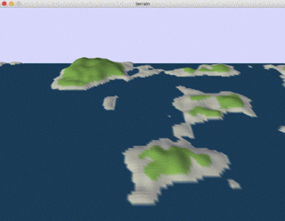

# 🏔 Os

Os is an generative art project that generates an endless video of different landscapes based on Audio Input.
Currently it is mainly developed as a part of [Resonance](https://github.com/sync-union/Resonance) (A project that combines two eternal streams of ever changing, resonating music and land).

### Disclaimer
I just started out with this project and currently misuse the master branch as a develop branch 😬

## Progress
- [x] create terrain
- [x] create terrain based on audio input
- [x] be able to create different landforms
- [ ] be able to smootly transition into a new landform
- [ ] add weather
- [ ] ...

## About The Name
Os is a term that describes a long and winding landform that origined during the ice age. It is made out of sand and gravel and is often several kilometers long.

